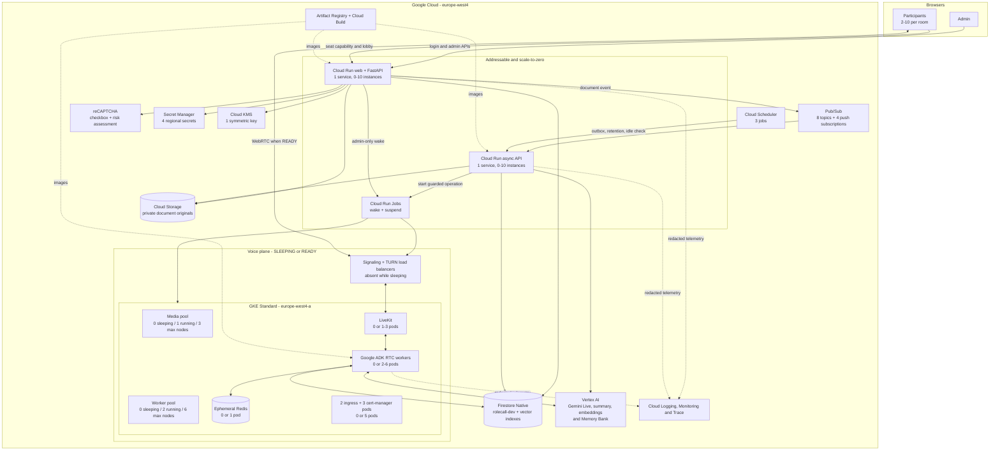

# RoleCallAI secure development architecture

RoleCallAI runs in Google Cloud project `proofroom-506314`. New application
processing and product data stay in `europe-west4`; the unrelated Firestore
`(default)` database is never addressed by the application or lifecycle scripts.

## System diagram

[Open the zoomable SVG export](diagrams/architecture.svg).

## Runtime shapes

| Resource | `SLEEPING` | `READY` minimum | Maximum |
| --- | ---: | ---: | ---: |
| Cloud Run web/control | 0 idle instances; starts on request | demand-based | 10 |
| Cloud Run async API | 0 idle instances | demand-based | 10 |
| Cloud Run runtime jobs | 0 | 0 except during transition | 1 task per job |
| GKE media nodes | 0 | 1 `e2-standard-4` | 3 |
| GKE worker nodes | 0 | 2 `e2-standard-4` | 6 |
| LiveKit pods | 0 | 1 | 3 |
| ADK voice-worker pods | 0 | 2 | 6 |
| Ephemeral Redis pods | 0 | 1 | 1 |
| Ingress and cert-manager pods | 0 | 5 | 5 |
| Repository-managed GKE pods | **0** | **9** | **15** |
| Signaling/TURN load-balancer services | 0 | 2 services / 3 forwarding rules | fixed |

GKE system DaemonSets and control-plane components are not included in the pod
count. The normal running shape is three nodes and nine repository-managed pods.
The sleeping shape retains the zonal GKE control plane but has zero nodes, zero
voice pods, and no LiveKit/TURN load-balancer services.

## Managed resource inventory

| Area | Provisioned resources | Purpose |
| --- | --- | --- |
| Identity | 8 service accounts, Workload Identity | Least-privilege application, build, scheduler and runtime roles. |
| Authentication | 1 reCAPTCHA key, 1 regional admin-credential secret | Shared admin login, Account Defender signals and versioned session invalidation. |
| Capabilities | 1 regional KMS key | Encrypt recoverable participant links; verification still uses SHA-256 digests. |
| Data | 1 named Firestore database | Rooms, sessions, throttles, transcripts, recaps, runtime state and 768-dimensional vectors. |
| Documents | 1 private regional bucket | Immutable PDF, DOCX, PPTX, TXT and Markdown versions. |
| Events | 4 event topics, 4 dead-letter topics, 4 push subscriptions | Post-processing, retention, document indexing and runtime control. |
| Scheduling | 3 Scheduler jobs | Minute outbox drain, daily retention cleanup and five-minute idle check. |
| AI | Gemini Live, Gemini summary, `gemini-embedding-001`, Memory Bank | Voice reasoning, recaps, document embeddings and retained meeting facts. |
| Secrets | 4 Secret Manager secrets | Admin hash, cookie signing and LiveKit API credentials. |
| Delivery | 1 Artifact Registry repository; manual Cloud Build | Control, jobs and worker images. |

## Trust and data boundaries

- The admin cookie and participant capability cookie are separate. Admin APIs
  require authentication plus Origin and CSRF validation.
- Participant links are decrypted only on an explicit authenticated request,
  returned with `Cache-Control: no-store`, and never written to telemetry.
- The deterministic meeting controller owns lifecycle, floor, timer and LiveKit
  publish permissions. Gemini cannot override those controls.
- `search_room_docs(query)` is server-scoped to the occurrence's frozen ready
  document versions. The model never supplies a room, document or occurrence ID.
- Retrieved document text is evidence, never instructions. It cannot alter
  authorization, tool access, retention or meeting control.
- Browsers never access Firestore, GCS, KMS, Memory Bank or Gemini directly.
- Only finalized captions are persisted. Raw audio remains bounded in memory and
  LiveKit egress recording is not configured.
- Documents, chunks, transcripts, citations, recaps and memory facts expire
  after 90 days or are removed sooner through authenticated deletion.
- GenAI content capture is disabled; credentials, tokens, prompts, transcripts,
  document excerpts and audio are excluded from logs and traces.

## Sleep boundary

Real admin or participant interaction updates activity at most once per minute.
A passive browser tab does not. Every five minutes the scheduler checks whether
30 minutes have elapsed with no active lobby or meeting. The guarded suspend job
then blocks joins, removes the LiveKit/TURN services, scales workloads to zero,
and resizes both node pools to zero. Only an authenticated admin can request a
wake; participants receive a typed `runtime_asleep` response.

Related material: [deployment status](DEPLOYMENT.md), [normal flow](FLOW.md),
[operations](OPERATIONS.md), and
[current cost estimate](../infra/terraform/COST_ESTIMATE.md).
