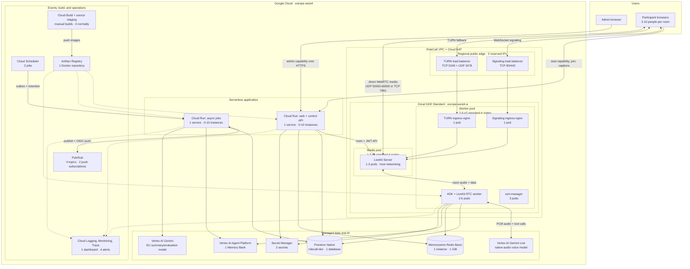

# RoleCallAI development architecture

This is the Phase 1 topology for the locally configured Google Cloud project.
New application processing and product data are in `europe-west4`; an existing
`(default)` Firestore database is not used.
Document upload and RAG are not part of this build.

## System diagram

[Open the zoomable SVG export](diagrams/architecture.svg).

The two load-balanced endpoints provide stable TLS signaling and TURN addresses.
LiveKit media itself uses direct public networking on the dedicated media node,
which is why the media pool uses GKE Standard with host networking rather than
Cloud Run, Autopilot, or a private-only cluster.

## Deployed counts and scale limits

| Layer | Deployed minimum / current steady state | Configured ceiling | Notes |
| --- | ---: | ---: | --- |
| Cloud Run web/control | 0 idle instances | 10 | One service; starts on an HTTP request. |
| Cloud Run async jobs | 0 idle instances | 10 | One internal service; invoked by Scheduler and Pub/Sub. |
| GKE cluster | 1 zonal Standard cluster | 1 | Google manages the control plane. |
| GKE media nodes | 1 `e2-standard-4` | 3 | Public IP, host networking, 50 GiB balanced boot disk. |
| GKE worker nodes | 2 `e2-standard-4` | 6 | ADK workers, ingress, cert-manager, and GKE system workloads. |
| LiveKit pods | 1 | 3 | One media pod per media node. |
| RoleCall ADK worker pods | 2 | 6 | Each process handles one live meeting at a time. |
| Ingress controller pods | 2 total | 2 | One signaling pod and one TURN pod. |
| cert-manager pods | 3 total | 3 | Controller, CA injector, and webhook. |
| Repository-managed GKE pods | **8 total** | **14 total** | Excludes GKE-managed system pods and DaemonSets, whose count follows node count. |
| Memorystore Redis | 1 Basic instance, 1 GiB | 1 | LiveKit routing, capability state, and rate limits. |
| Firestore | 1 named Native database | 1 | Rooms, occurrences, captions, outcomes, outbox, and retention metadata. |
| Agent Platform | 1 Memory Bank | 1 | Cross-meeting room memory; no RAG corpus. |
| Public edge | 2 reserved IPs, 2 load-balanced endpoints, 3 forwarding rules | Fixed | Signaling TCP plus TURN TCP/UDP. |
| Scheduler / Pub/Sub | 2 jobs, 4 topics, 2 subscriptions | Fixed | Includes two dead-letter topics. |
| Security / identity | 3 secrets, 7 service accounts | Fixed | Secret Manager, IAM, and Workload Identity; no key files. |
| Build | 0 active builds normally, 1 image repository | On demand | Manual Cloud Build, Cloud Storage source staging, and Artifact Registry. |
| Observability | 1 dashboard, 4 alert policies, 4 log-based metrics | Fixed configuration | Cloud Logging, Monitoring, managed Prometheus, and Trace. |

The normal running minimum is three VM nodes and eight repository-managed pods.
Cloud Run does not reserve an instance at idle because both services have a
minimum of zero.

## Trust and data boundaries

- The deterministic controller owns lifecycle, time, turn order, and LiveKit
  publish permissions; Gemini cannot bypass those checks.
- Capability secrets are exchanged from URL fragments and only SHA-256 digests
  are stored. Raw audio stays in bounded memory and is never recorded.
- Final transcript segments, recaps, and curated memory are retained for 90 days.
- Browsers never access Firestore, Redis, Memory Bank, Secret Manager, or Gemini
  directly. All product-data access is server-scoped.
- LiveKit and the workers use private Redis connectivity inside the VPC. Cloud
  NAT supplies controlled outbound access from GKE to Google APIs.

## Related material

- [Normal use-case flow](FLOW.md)
- [Suspend and resume runbook](OPERATIONS.md)
- [Current cost model](../infra/terraform/COST_ESTIMATE.md)
