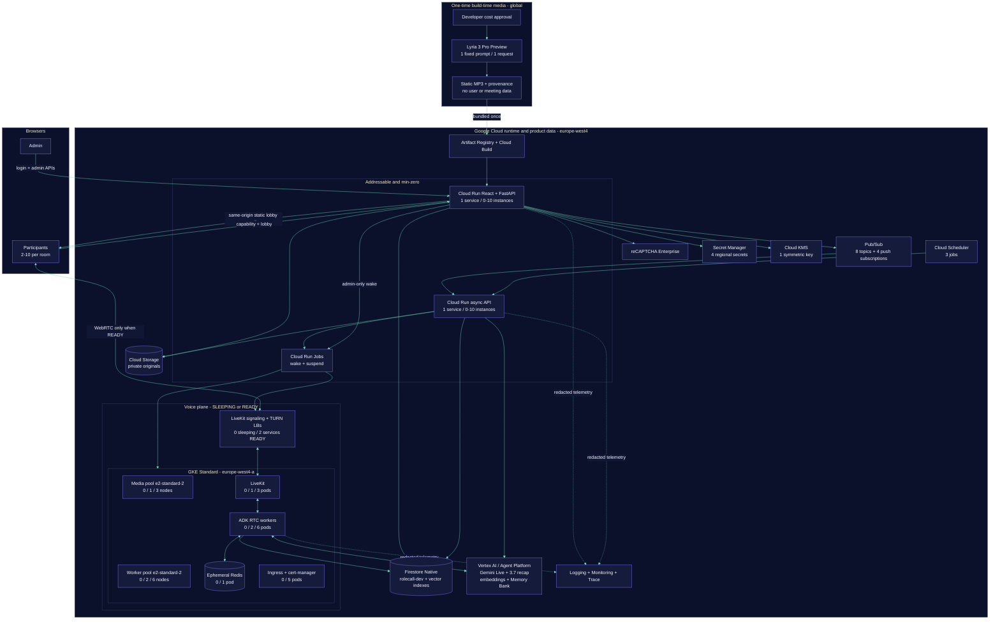

# RoleCallAI secure development architecture

RoleCallAI runs in project `proofroom-506314`. Meeting processing and product
data remain in `europe-west4`; voice is zonal in `europe-west4-a`. The
application addresses named Firestore database `rolecall-dev`, never the
unrelated `(default)` database.

One transparent exception is separate from runtime: a developer sent one
fixed, non-personal prompt to global Lyria 3 Pro at build time. The resulting
MP3 is an immutable web asset. Lyria is not in the meeting path.

## System diagram

[Open the zoomable SVG export](diagrams/architecture.svg).

## Runtime counts

| Resource | `SLEEPING` | `READY` minimum | Maximum |
| --- | ---: | ---: | ---: |
| Cloud Run web/control | 0 idle instances | demand-based | 10 |
| Cloud Run async API | 0 idle instances | demand-based | 10 |
| Cloud Run transition Jobs | 0 tasks | 0 except transition | 1 task/job |
| GKE media nodes | 0 | 1 × `e2-standard-2` | 3 |
| GKE worker nodes | 0 | 2 × `e2-standard-2` | 6 |
| LiveKit pods | 0 | 1 | 3 |
| ADK voice-worker pods | 0 | 2 | 6 |
| Redis pods | 0 | 1 | 1 |
| Ingress/cert-manager pods | 0 | 5 | 5 |
| Repository-managed GKE pods | **0** | **9** | **15** |
| Public signaling/TURN services | 0 | 2 services / 3 forwarding rules | fixed |

System DaemonSets are excluded. The conservative minimum is three
`e2-standard-2` nodes (6 vCPU, 24 GiB). Each worker requests 250m CPU/2 GiB and
retains a 2 vCPU/4 GiB limit. Sleeping retains the control plane and reserved
IPs but has zero nodes, pods, and public media services.

## Managed services

| Area | Service and count | Purpose |
| --- | --- | --- |
| Identity | 8 service accounts + Workload Identity | Least-privilege build, runtime, scheduling, and application identities. |
| Authentication | 1 reCAPTCHA key + regional admin secret | Bot-aware shared login and versioned invalidation. |
| Capabilities | 1 symmetric Cloud KMS key | Recover participant links explicitly; SHA-256 remains verifier. |
| Data | 1 named Firestore database | Rooms, sessions, transcripts, recaps, runtime, and vectors. |
| Documents | 1 private regional bucket | Immutable text-based source versions. |
| Events | 4 event + 4 DLQ topics; 4 push subscriptions | Index, recap, cleanup, and runtime orchestration. |
| Scheduling | 3 jobs | Outbox, retention, and five-minute idle check. |
| AI | 4 model/capability paths | Gemini Live, Gemini 3.7, embedding-001, Memory Bank. |
| Delivery | 1 registry + manual Cloud Build | Immutable control, jobs, and worker images. |
| Creative media | 1 Lyria-generated static MP3 | Build-time lobby ambience; zero runtime calls. |

## Trust boundaries

- The controller owns lifecycle, timer, floor, and LiveKit publish permission;
  Gemini cannot override those rules.
- `search_room_docs(query)` receives server-injected scope and only frozen ready
  versions. Retrieved text is evidence, never instructions.
- Admin and participant cookies are separate. Link reveal is explicit and
  `no-store`; capability secrets and JWTs are excluded from logs.
- Browsers never access Firestore, GCS, KMS, Memory Bank, or Gemini directly.
- Raw meeting audio is bounded and memory-only; only finalized text persists.
- Lyria receives no runtime request or user-derived input. Browser playback is
  a local static element, not a LiveKit track.
- Meeting/document data expires after 90 days; GenAI content capture is off.

Related: [normal flow](FLOW.md), [operations](OPERATIONS.md),
[Lyria boundary](LYRIA.md), and [cost estimate](../infra/terraform/COST_ESTIMATE.md).
