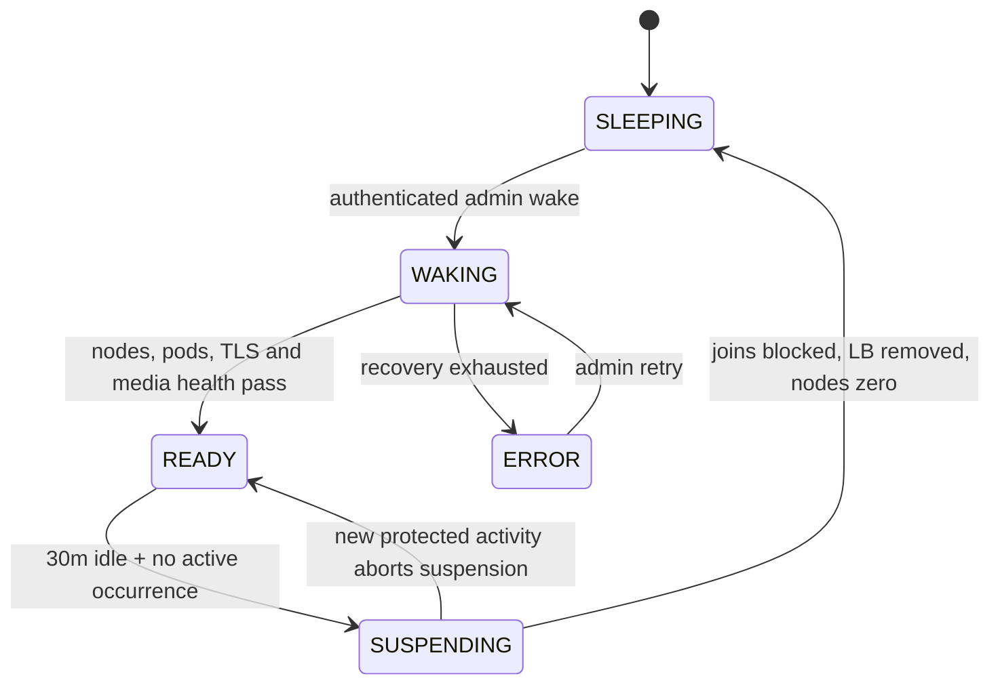
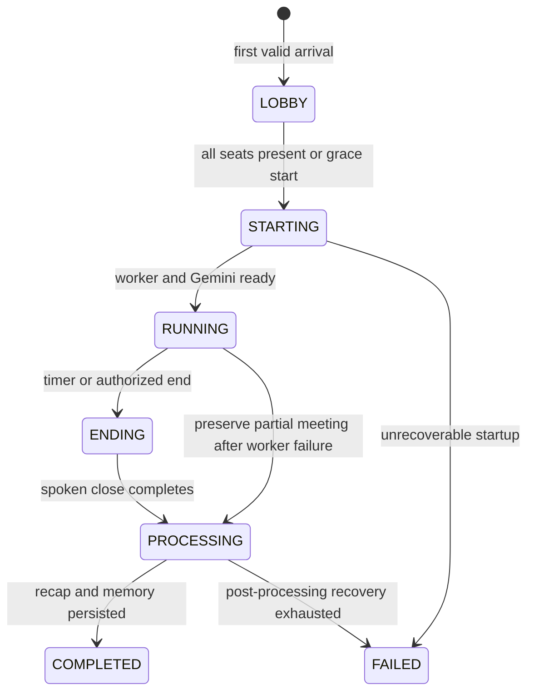

# RoleCallAI normal use-case flow

## End-to-end flow

[Open the zoomable sequence export](diagrams/normal-use-flow.svg).

```mermaid
sequenceDiagram
    autonumber
    actor Admin
    actor P as Participants
    participant Web as Cloud Run web/control
    participant Sec as reCAPTCHA + Secret Manager + KMS
    participant DB as Firestore rolecall-dev
    participant Q as Pub/Sub / async jobs
    participant Store as Cloud Storage
    participant Runtime as Runtime job + GKE
    participant LK as LiveKit
    participant Agent as ADK voice worker
    participant AI as Vertex AI Gemini

    Admin->>Web: Open landing page and submit login
    Web->>Sec: Verify CAPTCHA action, hostname, score and account signals
    Web->>DB: Enforce IP/prefix throttle; create 8-hour session
    Web-->>Admin: Secure HttpOnly admin cookie + dashboard

    alt Voice runtime is sleeping
      Admin->>Web: Click Wake voice services
      Web->>DB: Record genuine activity and WAKING state
      Web->>Runtime: Start idempotent wake job
      Runtime->>Runtime: Restore 2 worker + 1 media nodes and 9 pods
      Runtime->>LK: Restore signaling/TURN services and health-check media
      Runtime->>DB: Mark READY
      Web-->>Admin: Poll and show progress (normally 10-20 minutes)
    end

    Admin->>Web: Create or edit a room
    Web->>DB: Save owner, role, seats and instructions
    Web->>Sec: KMS-encrypt each participant capability
    Admin->>Web: Explicitly reveal participant links
    Web->>Sec: Decrypt seat capabilities
    Web-->>Admin: no-store link response

    opt Add meeting context
      Admin->>Web: Upload PDF/DOCX/PPTX/TXT/Markdown
      Web->>Store: Store immutable private version
      Web->>Q: Publish document-index event
      Q->>Store: Malware scan, signature check and text extraction
      Q->>AI: Create 768-dimensional chunk embeddings
      Q->>DB: Store sanitized chunks/vectors; atomically mark READY
      Web-->>Admin: Show indexing status
    end

    loop Each participant
      P->>Web: Open unique seat link and exchange fragment capability
      Web->>DB: Verify SHA-256 digest and reject duplicate active seat
      Web-->>P: Secure participant cookie; scrub URL fragment
      P->>Web: Enter name, consent and lobby action
      alt Runtime is not READY
        Web-->>P: 503 runtime_asleep (participant cannot wake it)
      else Runtime is READY
        Web->>DB: First arrival transactionally creates occurrence
        Web->>DB: Snapshot ready active document versions
        Web-->>P: LiveKit URL and short-lived JWT
        P->>LK: Join browser audio room
      end
    end

    Web->>LK: Dispatch occurrence after all seats or two-minute grace
    LK->>Agent: Worker joins as named facilitator
    Agent->>DB: Load room, prior recap and frozen document versions
    Agent->>AI: Start resumable native-audio ADK session

    loop Deterministic turns
      Agent->>LK: Grant microphone publish only to floor owner
      P->>LK: Current speaker audio; others may raise hand
      LK->>Agent: PCM16 audio
      Agent->>AI: Audio, meeting state and server-scoped tools
      opt Document context is useful
        AI->>Agent: search_room_docs(query)
        Agent->>DB: Vector search within room + frozen versions only
        DB-->>Agent: Up to 5 sanitized excerpts and citations
      end
      AI-->>Agent: Native audio + finalized caption
      Agent-->>LK: Audio, caption and source chips
      LK-->>P: Facilitator response and UI updates
      Agent->>DB: Persist finalized text/outcomes/citations only
    end

    Agent-->>P: Spoken closing recap
    Agent->>Q: Idempotent post-processing event
    Q->>AI: Typed summary and validation
    Q->>DB: Recap, citations and stable-seat memory, then mark COMPLETED
    Web-->>Admin: History, transcript, recap and meeting quality details
    Web-->>P: Latest attended recap

    Note over Web,Runtime: After 30 minutes without genuine activity and no active meeting, the scheduler suspends the voice plane.
```

## Runtime lifecycle

[Open the zoomable runtime lifecycle](diagrams/runtime-lifecycle.svg).



## Meeting lifecycle

[Open the zoomable meeting lifecycle](diagrams/meeting-lifecycle.svg).



The floor controller, not Gemini, controls turn order and microphones. An admin
may delegate “end for everyone” to selected seats. Late arrivals join the
remaining turn order, disconnected speakers retain the floor for 30 seconds,
and a failed agent is allowed 60 seconds to recover before partial processing.

See [deployment status](DEPLOYMENT.md) for the verified live revisions and
end-to-end acceptance results, and [operations](OPERATIONS.md) for the wake and
suspend runbook.
