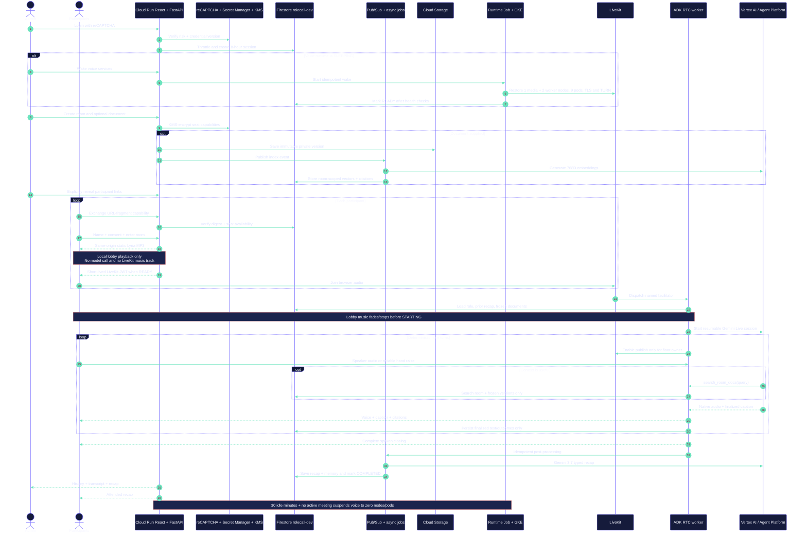
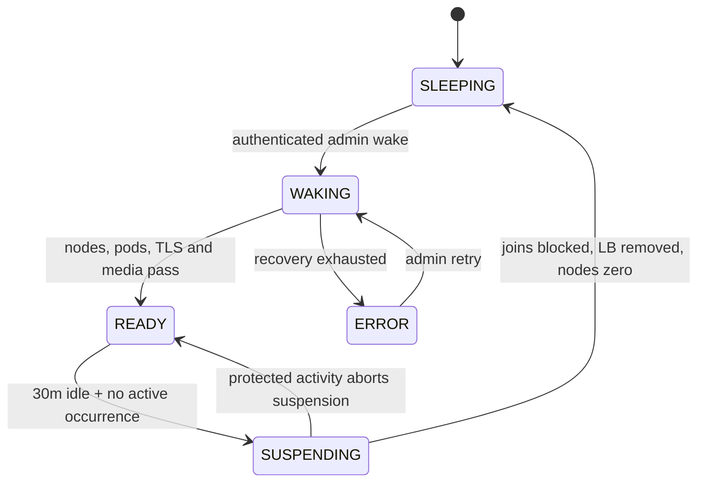
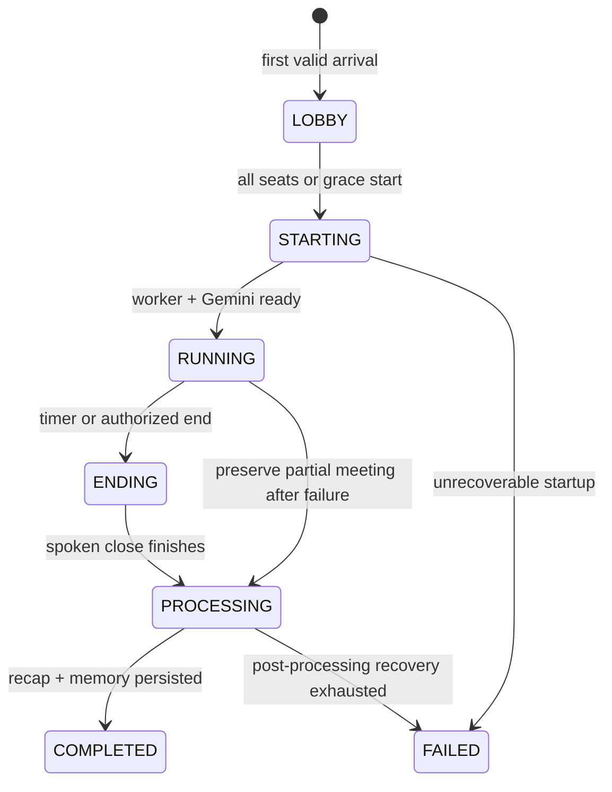

# RoleCallAI normal use-case flow

[Open the zoomable sequence export](diagrams/normal-use-flow.svg).

## Runtime lifecycle

[Open the zoomable runtime lifecycle](diagrams/runtime-lifecycle.svg).

## Meeting lifecycle

[Open the zoomable meeting lifecycle](diagrams/meeting-lifecycle.svg).

The floor controller—not Gemini—controls transitions and microphones. An admin
can delegate **End for everyone**. Late arrivals join the remaining order;
disconnected speakers keep the floor for 30 seconds; the worker gets a bounded
recovery window before partial processing.

See [reproducible testing](REPRODUCIBLE_TESTING.md) for a judge walkthrough and
[operations](OPERATIONS.md) for wake/suspend behavior.
