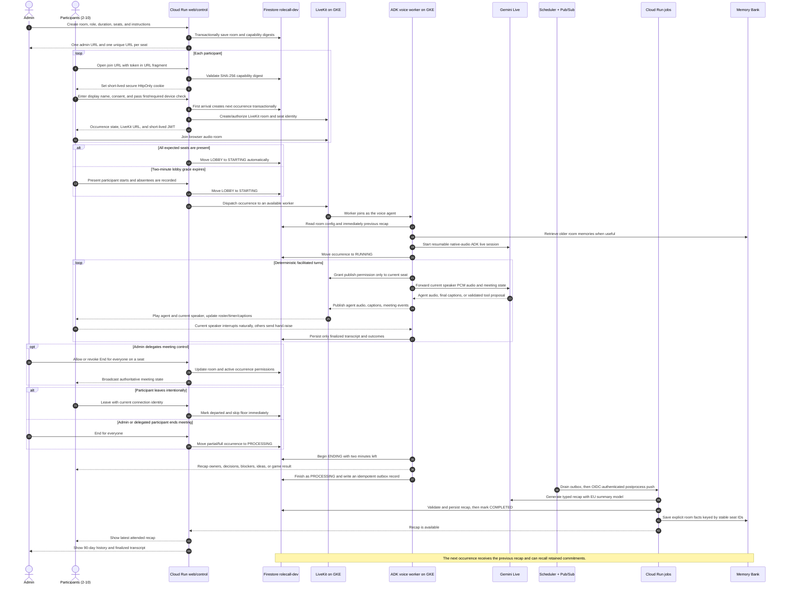
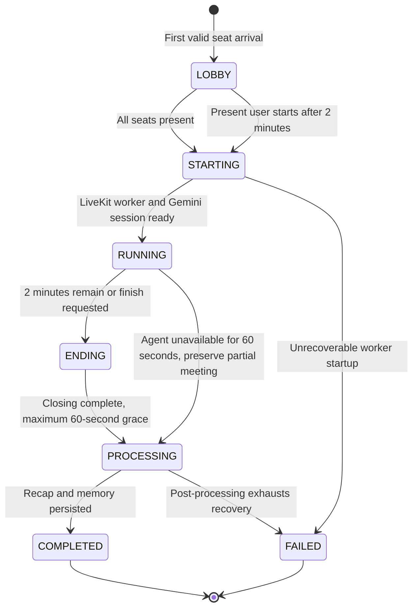

# RoleCallAI normal use-case flow

## End-to-end sequence

[Open the zoomable sequence SVG](diagrams/normal-use-flow.svg).

## Meeting lifecycle

[Open the zoomable lifecycle SVG](diagrams/meeting-lifecycle.svg).

## What changes by role

- **Scrum Master:** follows the stable seat order, recalls earlier commitments,
  probes blockers, and closes with owners and actions.
- **Fun Friday Organizer:** chooses or follows the configured game, rotates equal
  turns, tracks scores where applicable, and announces results.
- **Brainstorm Facilitator:** frames the topic, gathers divergent ideas, clusters
  and prioritizes them, and converts them into next steps.
- **Sprint Retrospective, Project Status, and Incident Response:** run blameless
  improvement, cross-team status, or fact-disciplined restoration workflows.
- **Course Instructor, Workshop Facilitator, and Technical Interviewer:** teach,
  guide collaborative activities, or evaluate fairly with balanced turns.
- **Product Discovery, Decision-Making, and Town Hall:** uncover evidence before
  solutions, compare options against criteria, or moderate relevant Q&A.
- **Custom:** applies the admin instructions inside the same timed, server-enforced
  floor and lifecycle framework.
